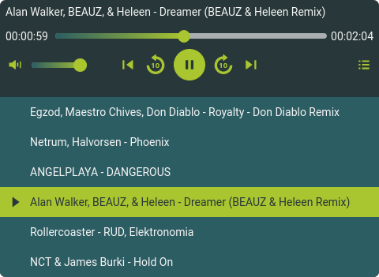

# JukeboxJS



Web Component to add an audio player to your website in a very easy way, programmed using only web standards, without any external dependencies.

You can view some examples [here](https://son-link.github.io/jukeboxjs)

Source code under the MIT license

## Install:

### From source
You just need to clone this repository or click on Code -> Download zip and copy the jubeboxjs.js file and the assets folder where you need it.

Once done you must import the script using the &lt;script> tag.
```html
<script src="jukebox.js" defer></script>
```

### CDN

You can also use the CDN, which also has the icons embedded. It's heavier, but you don't need to copy the assets folder, plus you'll always have it up to date.

You can also download it and use it directly on your website.

```html
<script src="https://cdn.jsdelivr.net/gh/son-link/jukeboxjs@main/jukeboxjs.cdn.js"></script>
```

### Using tag

To embed the player on your website you must use the following tag:
```html
<jubebox-js />
```

## Tag parameters

* **src**: The URL to an audio file.
* **playlist**: The URL to a playlist. This can be a simple text file with one address per line, or using the M3U format (recommended if you want to display artist and title).
* **color-text**: The color of the text
* **color-bg**: the color of the background and text of the current track in the playlist
* **color-btn**: the color of the buttons, the thumb of the range and the background of the current track in the playlist
color-playlist: The background color of the playlist
* **color-range**: The color, or colors, of the volume and position ranges. These are 2 colors separated by a comma (start and end color of the gradient), or a single color.

**Note**: Colors can be in hexadecimal (#rrggbb), RGB (e.g. rgb(255, 0, 150)) or RGBA (e.g. rgba(255, 0, 150, 0.5)) format.

## Extra credits

The music uploaded here has been downloaded from https://audionautix.com, created by Jason Shaw and licensed under the [Creative Commons Attribution 4.0 International License](https://audionautix.com/creative-commons-music).

Syntactic highlighting in the examples thanks to [Prism](https://prismjs.com/index.html)